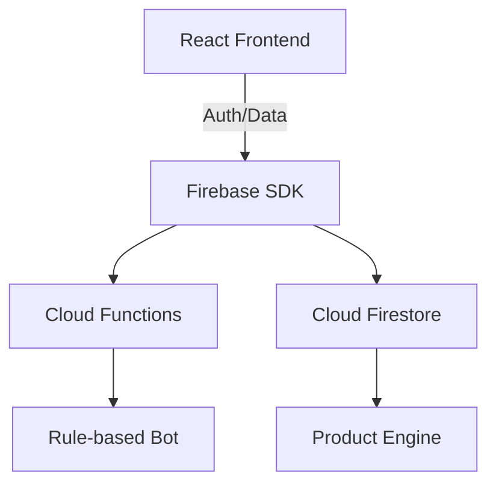

# AYBUStore
### Intelligent Campus E-Commerce Ecosystem

**CENG306 Term Project Final Proposal**

Muhammed Yıldız (myz21) • Utkan Dindaroğlu • Ahmet Selim Yılmaz
Seyfullah Gülyazı • Süleyman Fatih Sert

Ankara Yıldırım Beyazıt University • Spring 2025–2026

---
layout: center
---

# Project Foundation
### Problem Definition and Mission

AYBU currently operates with a single-point physical store while students are distributed across Esenboğa, Etlik, Bilkent, and Çubuk campuses.

**The Challenges:**
- Unequal Access for remote campus students
- Fragmented Service Continuity
- High Travel and Time Costs

**Mission:**
Transforming the physical model into a continuous, location-independent digital ecosystem.

---
layout: two-column
---

# Literature Review
### Identifying Research Gaps

We reviewed 12 peer-reviewed studies identifying a critical common gap:

- Prior work treats **Service Quality**, **Hyperlocal Logistics**, **Web Performance**, and **Chatbot Support** as isolated tracks.
- AYBUStore integrates these into a single closed-loop model.

::right::

**Key Sources:**
- Gong & Yi (2018): Service Quality
- Urquhart et al. (2022): Last-mile constraints
- Netravali et al. (2018): Robust TTI measurement
- Güldal & Dinçer (2025): Support automation

---
layout: center
---

# SMART Objectives
### Quantifying Success Criteria

  

    <h2 class="text-4xl font-bold">30%</h2>
    
Access Equity Increase

  

  

    <h2 class="text-4xl font-bold">&lt; 1.5s</h2>
    
Target TTI Performance

  

  

    <h2 class="text-4xl font-bold">60%</h2>
    
Support Response Reduction

  

"A data-driven approach to campus commerce modernization."

---
layout: two-column
---

# User Interface
### Hero and Navigation

The landing page features AYBU institutional branding and a responsive category navigation system.

- **Dynamic Hero Section**: Real-time product highlights.
- **Campus Awareness**: Targeted discovery layers.
- **Responsive Navigation**: Optimized for mobile and desktop access.

::right::

  
  

---
layout: two-column
---

# Product Ecosystem
### Discovery and Marketplace

A multi-vendor capable product grid designed for academic and daily needs.

- **Fast Loading**: Optimized images for sub-1.5s TTI.
- **Categorization**: Grouped by department and campus availability.
- **Live Search**: Instant product filtering.

::right::

  

---
layout: two-column
---

# Security & Access
### OTP Authentication Flow

Ensuring a closed-loop system limited to SIS-verified students.

- **SEC-1**: 100% secure access control.
- **OTP Verification**: Eliminating unauthorized transactions.
- **Seamless Integration**: Automated verification via university mail.

::right::

  

---
layout: center
---

# Technical Architecture
### Cloud-Native Scalability

**Stack:** React 18, TypeScript, Firebase (Auth, Store, Functions), Next.js 14.

---
layout: two-column
---

# Effort Estimation
### COCOMO Analysis

Calculated using the Intermediate COCOMO Model for a semi-detached software project.

- **Estimated Size**: ~5,200 LOC
- **Effort**: 16.5 Person-Months
- **Duration**: 7.2 Months
- **Average Personnel**: 2.3

::right::

| Multiplier | Value | Description |
|---|---|---|
| RELY | 1.15 | High Reliability |
| DATA | 1.08 | Large Data Size |
| CPLX | 1.15 | High Complexity |
| ACAP | 0.86 | High Analyst Cap |

---
layout: center
---

# Project Timeline
### Agile/Scrum Methodology

- **Sprint 1**: Backend Infrastructure & Core Database Schema.
- **Sprint 2**: Storefront Development & UI/UX Finalization.
- **Sprint 3**: Integration of Support Automation & Pilot Testing.

**Milestone:** Pilot launch with 300+ active students for statistical validation.

---
layout: cover
---

# Thank You
### Questions & Discussion

**AYBUStore: Intelligent Campus E-Commerce Ecosystem**

[myz21.github.io/aybustore](https://myz21.github.io/aybustore)

Muhammed Yıldız (myz21) • Utkan Dindaroğlu • Ahmet Selim Yılmaz
Seyfullah Gülyazı • Süleyman Fatih Sert

