# Schedify – Full PlantUML Diagram Set

Bu doküman, SRS içinde geçen tüm UML diyagramları için PlantUML kodlarını içerir.

---

# 1. Use Case Diagram

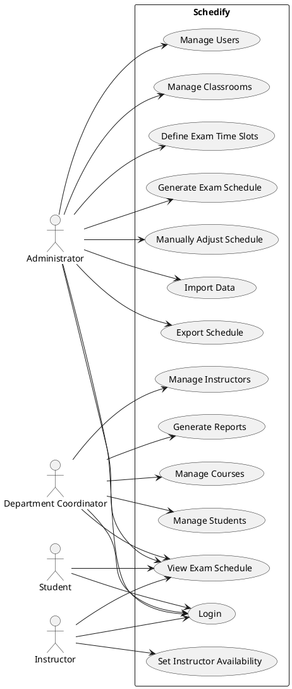

---

# 2. Activity Diagram – Exam Scheduling Workflow

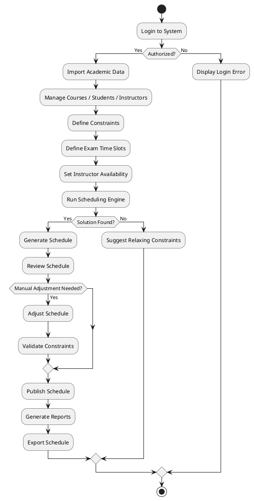

---

# 3. Sequence Diagram – User Authentication

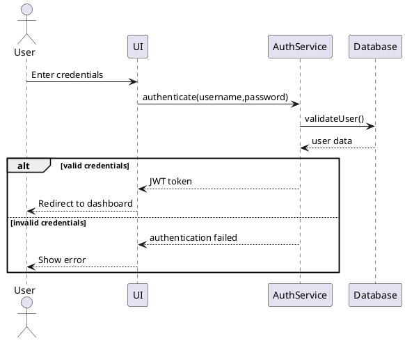

---

# 4. Sequence Diagram – Managing User Accounts

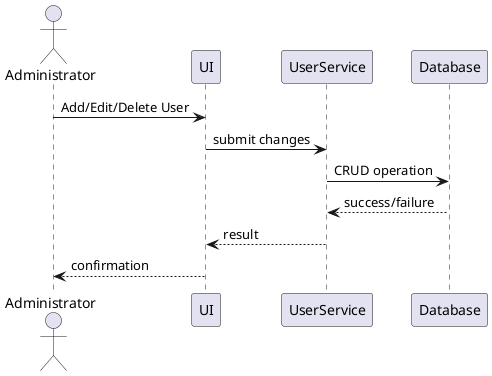

---

# 5. Sequence Diagram – Managing Course Data

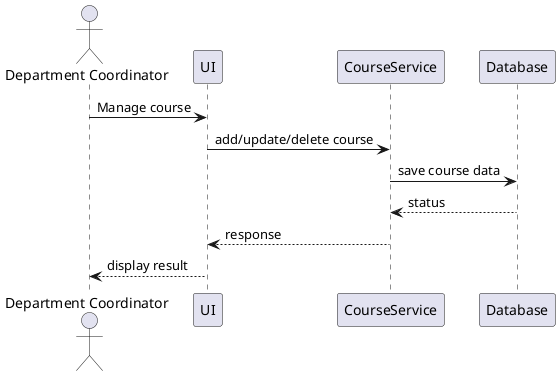

---

# 6. Sequence Diagram – Managing Student Data

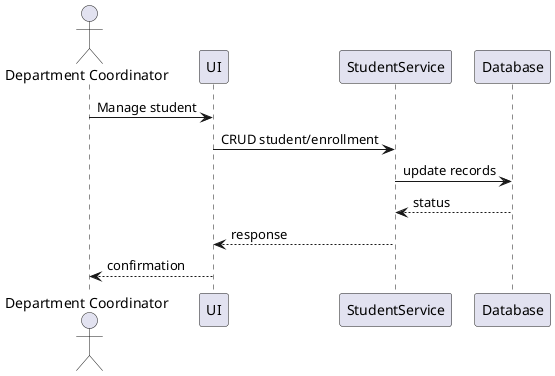

---

# 7. Sequence Diagram – Managing Instructor Data

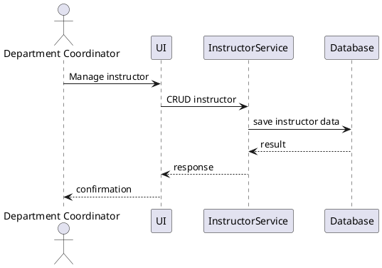

---

# 8. Sequence Diagram – Managing Classroom Data

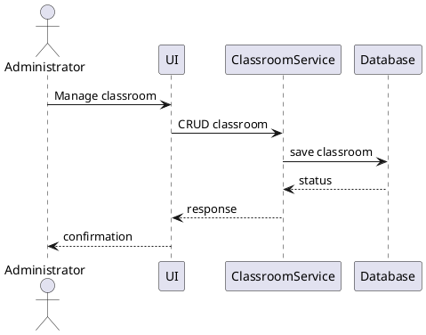

---

# 9. Sequence Diagram – Defining Exam Time Slots

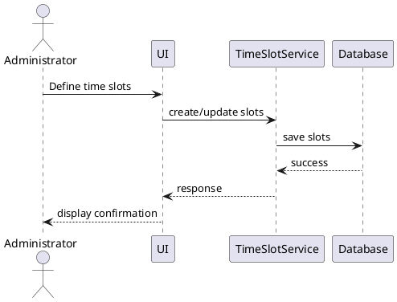

---

# 10. Sequence Diagram – Setting Instructor Availability

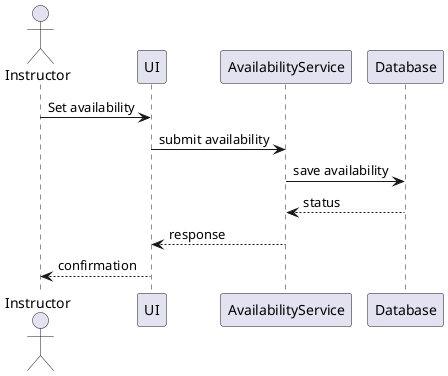

---

# 11. Sequence Diagram – Generating Exam Schedule

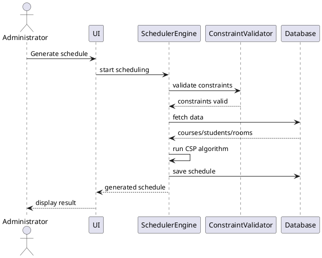

---

# 12. Sequence Diagram – Viewing Exam Schedule

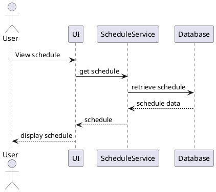

---

# 13. Sequence Diagram – Manually Adjusting Schedule

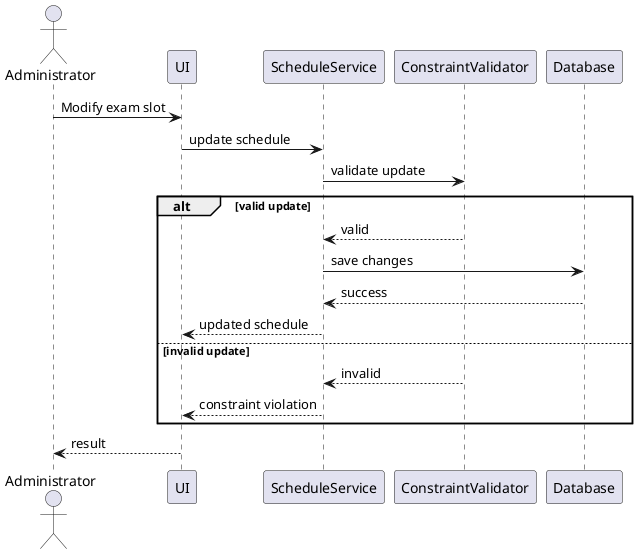

---

# 14. Sequence Diagram – Generating Schedule Reports

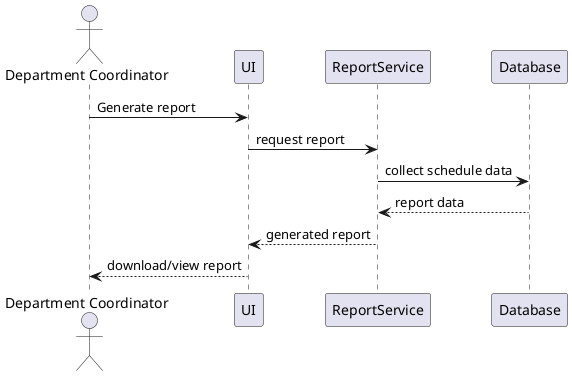

---

# 15. Sequence Diagram – Importing Data

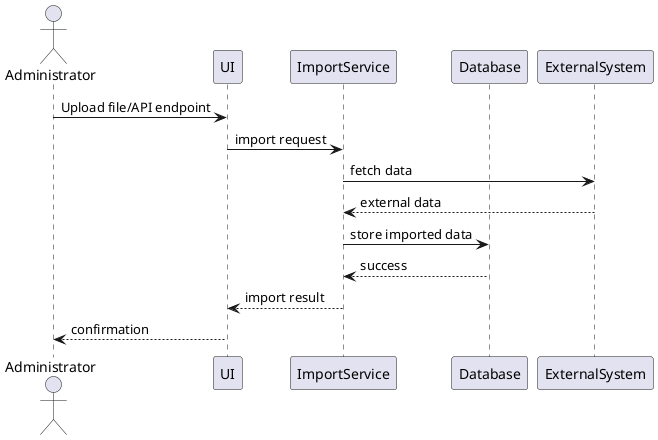

---

# 16. Sequence Diagram – Exporting Data

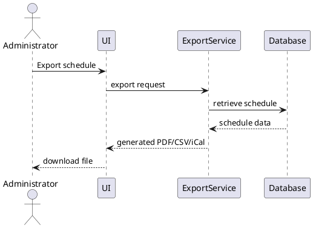

---

# 17. Analysis Object Model (Class Diagram)

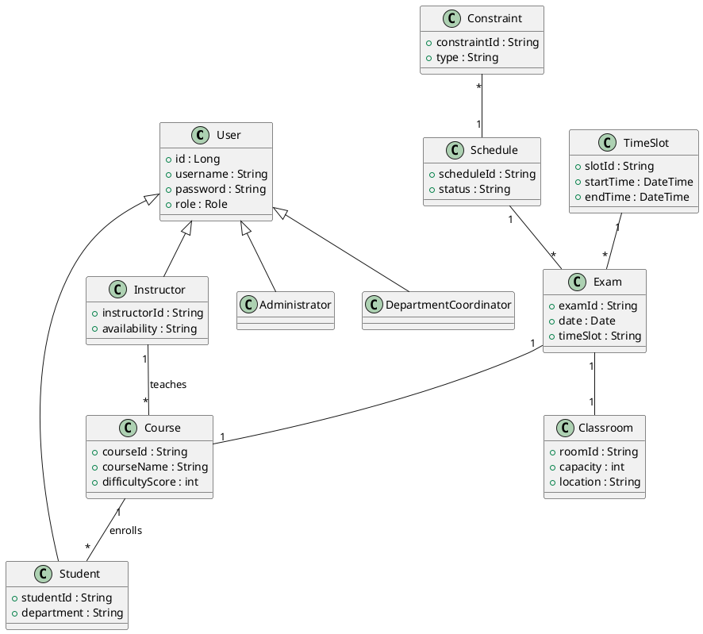

---

# 18. Component Diagram

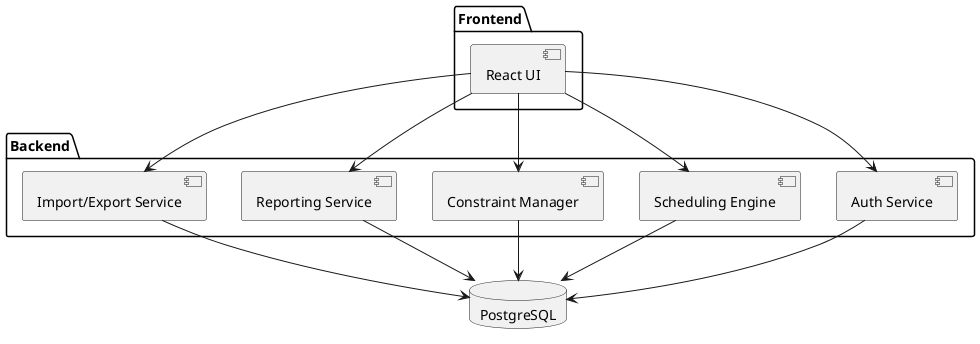

---

# 19. Deployment Diagram

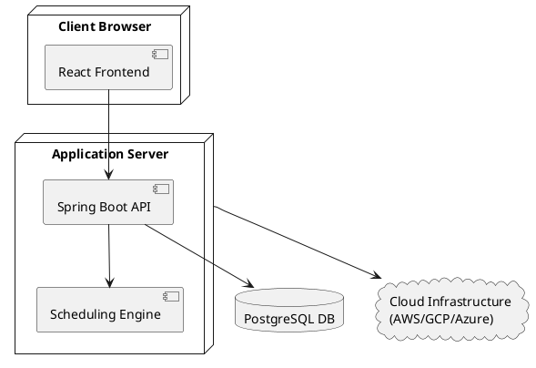

---

# 20. State Diagram – Exam Schedule Lifecycle

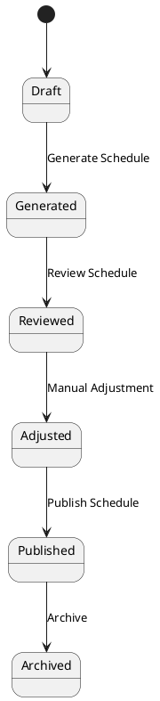

